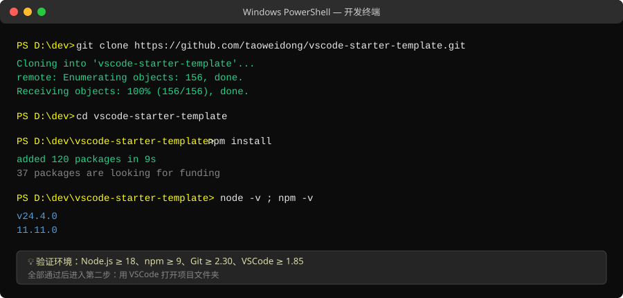

# 01 · 环境准备与代码下载

> 目标：把仓库代码拉到本地，装好依赖，并通过一次编译验证环境正确。
> 预计耗时：10 分钟（不含软件安装）。

## 1. 前置软件清单

| 软件 | 版本要求 | 下载地址 | 验证命令 |
| --- | --- | --- | --- |
| Node.js | ≥ 18（建议 LTS） | https://nodejs.org/zh-cn | `node -v`、`npm -v` |
| Git | ≥ 2.30 | https://git-scm.com/downloads | `git --version` |
| VSCode | ≥ 1.85 | https://code.visualstudio.com/ | 帮助 → 关于 |

> Windows 用户建议安装时勾选「Add to PATH」；公司网络下 npm 可改用镜像：
> `npm config set registry https://registry.npmmirror.com`

## 2. 克隆代码

任选一种方式：

**方式 A：git clone（推荐，便于后续提交推送）**

```bash
git clone https://github.com/taoweidong/vscode-starter-template.git
cd vscode-starter-template
```

**方式 B：直接下载 ZIP**
浏览器打开仓库页面 → 绿色 `Code` 按钮 → `Download ZIP` → 解压。
（用 ZIP 方式无法直接 `git push`，二次开发建议用方式 A。）



## 3. 安装依赖

```bash
npm install
```

正常输出 `added 120 packages in …` 即成功。**不要**使用 `npm install --production`——
TypeScript、esbuild、测试框架都在 devDependencies 里。

## 4. 环境验证（推荐直接跑门禁）

```bash
npm run gate
```

门禁会依次执行：类型检查 → 生产构建 → 测试编译 → 静态一致性检查 → 全量单元测试。

> ⚠️ **首次运行会自动下载一个独立的测试用 VSCode（约 1GB）**到 `.vscode-test/` 目录，
> 耗时取决于网速；下载一次后缓存复用。该目录已被 `.gitignore` 忽略，不会进仓库。
> 只想快速验证编译的话，可以执行 `npm run compile`（约 3 秒）。

输出末尾出现 **`✓ 门禁全部通过，可以提交/推送`** 即环境完全就绪。

## 5. 项目目录速览

| 路径 | 职责 |
| --- | --- |
| `src/extension.ts` | 插件入口：组装数据源、服务、视图、命令、启动任务 |
| `src/models/` | 数据模型 Item / ItemDraft（二次开发第一站） |
| `src/services/` | 业务层 + `IItemStore` 数据源抽象（默认 JSON 文件） |
| `src/providers/` | 树视图、Webview 表单面板 |
| `src/features/` | 四个功能页面（环境初始化/特性配置/静态配置/分支编译） |
| `src/tasks/` | 启动任务框架（环境检测） |
| `src/webview/` | Schema 驱动的表单渲染器 |
| `scripts/gate.js` | 一键式质量门禁的实现 |
| `.vscode/launch.json` | F5 调试配置（已就绪，无需修改） |

## 6. 常见问题

| 现象 | 处理 |
| --- | --- |
| `npm install` 卡住/超时 | 切换 npm 镜像（见第 1 节）后重试；或检查代理设置 |
| `gate` 在第 5 步卡住 | 正在下载测试用 VSCode，属首次运行正常现象，耐心等待 |
| Windows 提示「禁止运行脚本」 | 仅影响 PowerShell 脚本，本项目用不到；npm 命令不受影响 |
| 克隆慢 | 走镜像站或使用 ZIP 方式（见第 2 节） |

环境就绪后，继续阅读 [02 · 开发与调试步骤](02-开发与调试步骤.md)。
