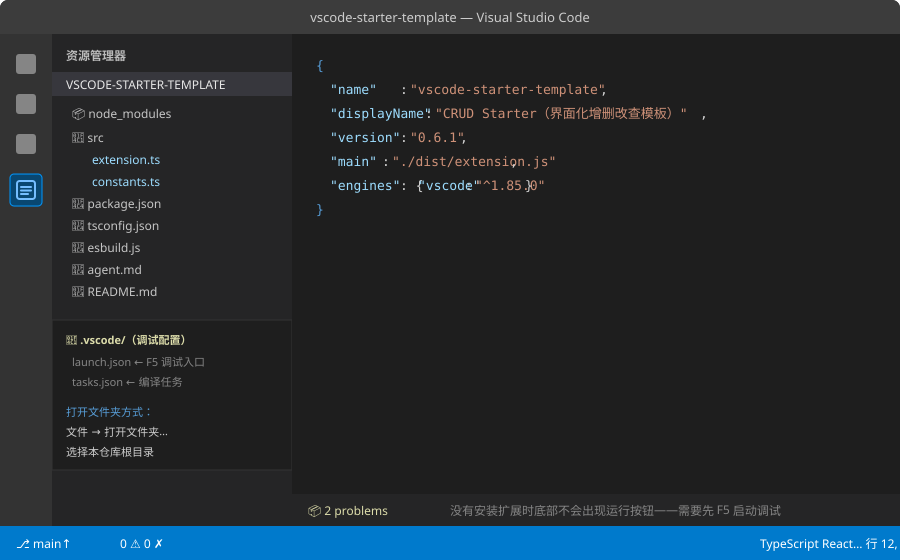
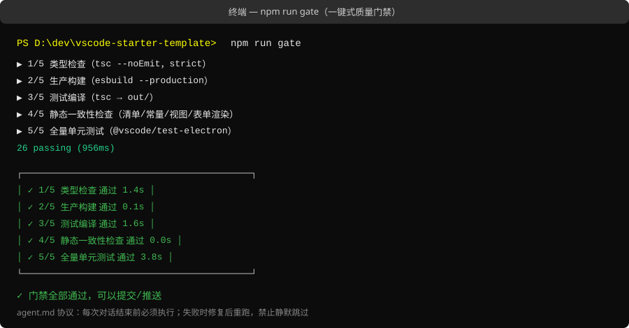
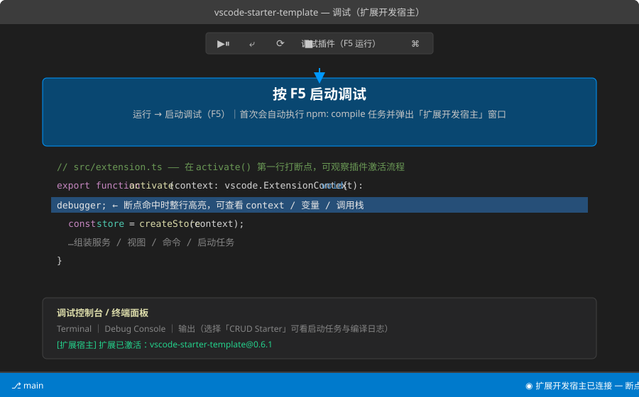
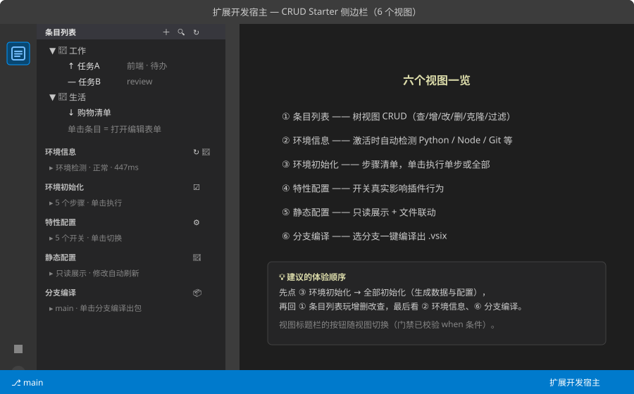
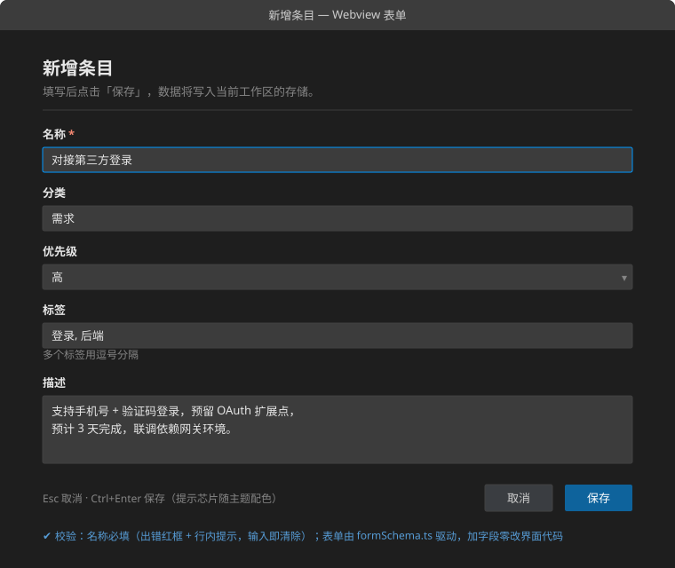
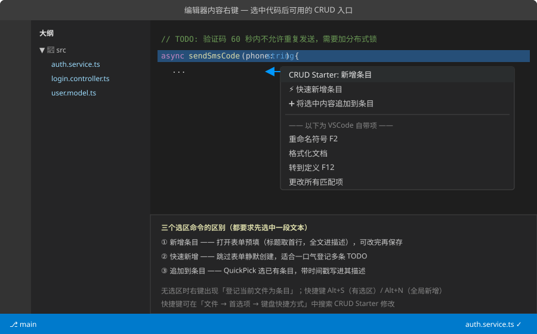
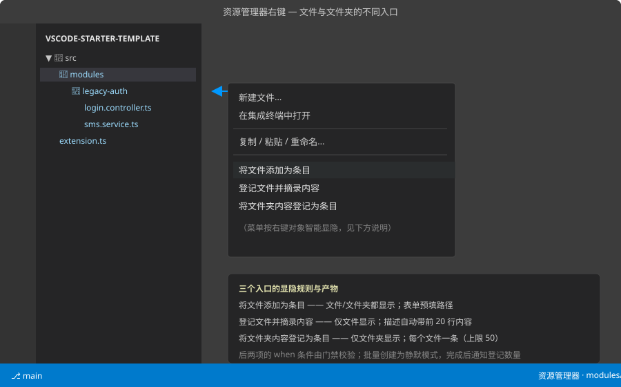

# 02 · 开发与调试步骤

> 前置：已完成 [01 · 环境准备与代码下载](01-环境准备与代码下载.md)。
> 目标：跑起调试、亲手体验全部界面功能、学会断点与调试循环。

## 1. 用 VSCode 打开项目

启动 VSCode → **文件 → 打开文件夹…** → 选择仓库根目录
（目录里有 `.vscode/launch.json`，打开后调试配置自动就绪）。



> 打开时如果提示「是否信任此文件夹」，选择「是，我信任」。

## 2. 先跑一遍门禁（可选但推荐）

```bash
npm run gate
```



这一步确认拉到的代码在你机器上是健康的；同时缓存测试用 VSCode（后续 `npm test` 秒级启动）。

## 3. F5 启动调试

直接按 **F5**（或 运行 → 启动调试）。VSCode 会：

1. 自动执行 `npm: compile` 任务（preLaunchTask，无需手动编译）；
2. 弹出第二个窗口——**「扩展开发宿主」**，你的插件就运行在这个窗口里；
3. 原窗口保持可用：断点、调试控制台、变量查看都在这里。



停止调试：调试工具栏的 **■** 按钮，或关闭扩展开发宿主窗口。

## 4. 体验六大视图（扩展开发宿主窗口里）

扩展开发宿主的活动栏会出现 **CRUD Starter** 图标，点进去共 6 个视图：



推荐体验顺序：**③ 环境初始化（全部初始化）→ ① 条目列表（增删改查）→ ② 环境信息 → ⑥ 分支编译**。

## 5. 体验核心交互

**新增/编辑条目**：条目列表标题栏 ＋，或单击任意条目——弹出 Schema 驱动的 Webview 表单：



**编辑器右键**（在宿主窗口随便打开一个代码文件，选中一段文本后右键）：



**资源管理器右键**（对 `src` 下任意文件/文件夹右键——注意文件与文件夹的菜单项不同）：



数据落在工作区的 `.vscode/crud-starter-items.json`（可用「打开数据文件」命令直达）。

## 6. 断点调试

1. 在原窗口打开 `src/extension.ts`，在 `activate()` 函数体内任意一行行号左侧**单击**打红点；
2. 按 F5 重启调试 → 扩展宿主窗口启动时代码停在断点；
3. 用顶部调试工具栏：`⤶` 单步跳过、`↓` 单步进入、`▶` 继续；
4. 左侧「变量」面板查看 `context`、`service` 等对象；「调试控制台」可直接执行表达式
   （例如输入 `vscode.workspace.name` 回车）。

> 想调试 Webview 表单：在扩展开发宿主按 `Ctrl+Shift+P` → 输入
> `Developer: Open Webview Developer Tools`，可审查表单 DOM 与报错。

## 7. 改代码后的调试循环

| 方式 | 操作 | 适合 |
| --- | --- | --- |
| 重启调试 | 改完 → F5（preLaunchTask 自动重新编译） | 偶尔改动 |
| watch 模式 | 终端跑 `npm run watch` → 宿主窗口 `Ctrl+Shift+P` → `重新加载窗口` | 频繁改动 |

> watch 模式下改动即时打包到 `dist/`，只需重载宿主窗口，不用重启调试会话。

## 8. 常见调试问题

| 现象 | 原因与处理 |
| --- | --- |
| 宿主窗口活动栏没有 CRUD Starter 图标 | 检查宿主窗口右下角是否报扩展激活错误；先跑 `npm run gate` 排除构建问题 |
| F5 报 `preLaunchTask 失败` | 终端面板里有 tsc/esbuild 的具体报错，按报错修复后重试 |
| 断点不生效（灰色空心） | 代码没编译：确认 `dist/extension.js` 已更新（F5 会自动编译，手动跑 `npm run compile` 亦可） |
| 改了表单没变化 | 表单由 `formSchema.ts` 驱动，改完需重新编译 + 重载宿主窗口 |
| 首次 `gate`/`test` 很慢 | 正在下载测试用 VSCode（约 1GB，一次性），详见 [01](01-环境准备与代码下载.md) |

## 9. 收尾

改完代码准备交付时，按 `agent.md` 协议执行 **`npm run gate`**，全绿后再提交推送。
开发自己的插件请继续阅读 [03 · 插件开发指南](03-插件开发指南.md)。
